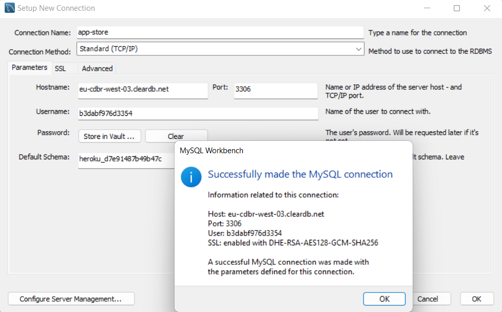

# Spring_REST_API-department-store-manager
Spring Project with JPA + H2 (Simple CRUD N:N) + ER with up to three Entities.
```
ENDPOINTS

Cashier

GET       /cashiers
POST      /cashiers
GET       /cashiers/{id}
PUT       /cashiers/{id}
DELETE    /cashiers/{id}

Product

GET       /products
POST      /products
GET       /products/{id}
PUT       /products/{id}
DELETE    /products/{id}

Sale

GET       /sales 
POST      /sales
GET	    /sales/{id}
PUT       /sales/{id}
DELETE    /sales/{id}

Cash

GET       /cashes 
POST      /cashes
GET	    /cashes/{id}
PUT       /cashes/{id}
DELETE    /cashes/{id}


```

####

